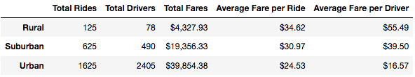
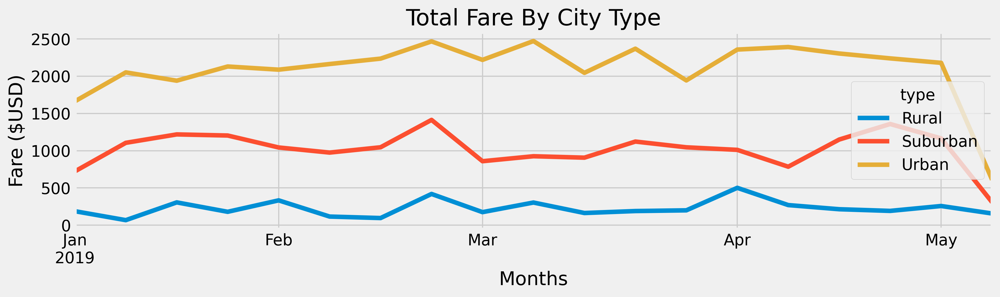

# Pyber Analysis

### Overview of Project
My client PyBer is a ride-sharing app company valued at $2.3 billion. In this analysis I will create a multiple-line graph that shows the total weekly fares for each city type over a period of time. This is a written report that summarizes how the data differs by city type and how those differences can be used by decision-makers at PyBer. 
### Project Purpose & Background
The purpose of this report is to analyze PyBer data to discover trends and produce a detailed perspective on how different variables may affect certain outcomes for PyBer in the future. Charts and graphs will be used to convey these findings to the company. These charts and graphs will aid in telling the complete story on how we arrived at our findings and how they can be of use to PyBer in their future endeavors and business operations. Let's take a look at some data:

#### Detailed breakdown of collected PyBer ride-sharing data based on city type:
- City Type: Rural, Suburban, Urban
```
Total Rides: Rural (125), Suburban (625), Urban (1625)

Total Drivers: Rural (78), Suburban (490), Urban (2405)

Total Fares: Rural ($4,327.93), Suburban ($19,356.33), Urban ($39,854.38)

Average Fare per Ride: Rural ($34.62), Suburban ($30.97), Urban ($24.53)

Average Fare per Driver: Rural ($55.49), Suburban ($39.50), Urban ($16.57)
```



### Differences in Collected Ride-Sharing Data & Visualization of Total Fare by City Type
To effectively arrive at my conclusion and conclude my analysis, the total fare by city type of PyBer ride fares was analyzed and visualized in the form of a multiple-line graph to convey valuable information to the client. Using data collected from the type summary data frame and data reflected in the multiple-line chart of this report, the differences in ride-sharing data among the different city types are as follows:

```
1. Revenue genereated by rural riders was significantly less than their urban counterparts
2. Suburban customers used the ride-sharing service more than any other demographic between the months of April & May
3. Urban clients generate the most revenue for the company and travel significantly between the months of February & April
```


## Summary
One conclusion that we have arrived at after analyzing our data is that riders in the rural cities and communities take far less rides than other cities and communities, however they pay the most-per-ride than any other demographic as illustrated in the data frame. Another conclusion is that there is a slight inverse correlation between where customers lived and how frequently, or infrequently they traveled during certain times of the year. This shows us that special attention needs to be paid to customers that are located in urban communities because overall they are the most revenue-generating clients.

By observing the “Total Fare By City” chart we can see that some suggestions can be made, hopefully to the C.E.O, for addressing a few disparities among the city types:
```
1. Promotional codes & discounts may be extremely effective if marketed towards higher paying riders such as those in urban communities to boost sales.
2. More drivers are needed in rural communities. A lack of available drivers is a contributing factor to low ride-share usage in rural communities.
3. Ride-share sales see a brief boost in rural communities during the month of April. More marketing efforts can be created to drive stronger sales during that month based around specific contributors and catalysts for the surge in ride-share demand.

* Note: All images that are screen shots are mine. All other photos are sources from Google Images.
